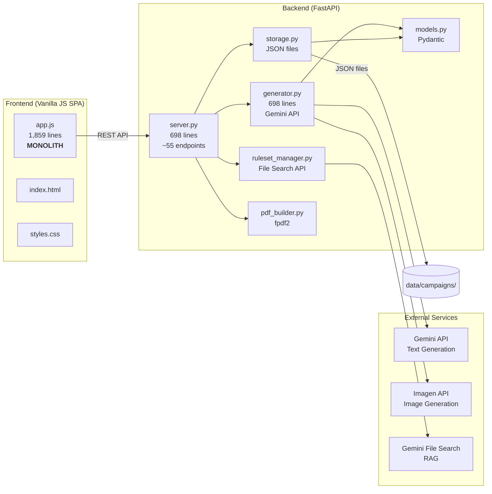

# AI GM Assistant — Current State Audit

**Date:** April 16, 2026  
**Scope:** Full codebase review of `ai-gm-assistant` (commit `dbaba33`)

---

## 1. Project Overview

The AI GM Assistant is a single-user, locally-hosted web application for TTRPG Game Masters. It combines campaign management (sessions, NPCs, locations, plot threads, adversaries) with AI-powered content generation via the Gemini API and RAG-based rule verification via Gemini File Search stores.

### Project Statistics

| Metric | Value |
|---|---|
| Backend Python files | 7 files (~82 KB) |
| Frontend files | 3 files (~130 KB) |
| Test files | 3 files (~7 KB) |
| Git commits | 6 |
| Dependencies | 7 runtime, 3 dev |
| Total source LOC | ~4,300 |

### File Size Breakdown

| File | Lines | Bytes | Concern |
|---|---|---|---|
| [app.js](file:///c:/Tools/ai-gm-assistant/static/app.js) | 1,859 | 79 KB | 🔴 **Monolith** |
| [server.py](file:///c:/Tools/ai-gm-assistant/src/server.py) | 698 | 27 KB | 🟡 Growing large |
| [generator.py](file:///c:/Tools/ai-gm-assistant/src/generator.py) | 698 | 28 KB | 🟡 Growing large |
| [styles.css](file:///c:/Tools/ai-gm-assistant/static/styles.css) | 1,190 | 27 KB | 🟢 Well-organized |
| [index.html](file:///c:/Tools/ai-gm-assistant/static/index.html) | 419 | 24 KB | 🟡 Moderate |
| [pdf_builder.py](file:///c:/Tools/ai-gm-assistant/src/pdf_builder.py) | 298 | 10 KB | 🟢 Reasonable |
| [models.py](file:///c:/Tools/ai-gm-assistant/src/models.py) | 262 | 8 KB | 🟢 Good |
| [storage.py](file:///c:/Tools/ai-gm-assistant/src/storage.py) | 136 | 4 KB | 🟢 Good |

---

## 2. Architecture Assessment

### 2.1 What's Working Well ✅

- **Clean data model layer** — Pydantic models in [models.py](file:///c:/Tools/ai-gm-assistant/src/models.py) are well-defined with proper enums, defaults, and clear domain separation.
- **Path resolution abstraction** — [paths.py](file:///c:/Tools/ai-gm-assistant/src/paths.py) cleanly handles dev vs. frozen (PyInstaller) mode.
- **RAG integration design** — The ruleset manager + File Search Store approach is architecturally sound. Grounding AI in actual rulebooks is the project's key differentiator.
- **Structured output pattern** — Using Pydantic schemas for Gemini responses with a `generate_with_retry` fallback is a solid pattern.
- **CSS design system** — Custom properties, consistent naming, well-structured sections. The dark-fantasy aesthetic is cohesive.
- **Installer pipeline** — Having a build script + Inno Setup for end-user distribution is mature for a hobby project.

### 2.2 High-Level Architecture Diagram



---

## 3. Backend Issues

### 3.1 🔴 `server.py` — Massive CRUD Duplication

The server contains **~55 endpoint handlers** following the same pattern for every entity type (Sessions, NPCs, Locations, Factions, Plot Threads, Adversaries). The update pattern is copy-pasted 6 times:

```python
# This exact pattern repeats for Session, NPC, Location, PlotThread, Adversary, Faction
@app.put("/api/campaigns/{campaign_id}/npcs/{npc_id}")
async def update_npc(campaign_id: str, npc_id: str, updates: dict):
    campaign = _get_campaign(campaign_id)
    for npc in campaign.npcs:
        if npc.id == npc_id:
            for key, value in updates.items():
                if hasattr(npc, key):
                    setattr(npc, key, value)
            campaign.updated_at = _now()
            storage.save_campaign(campaign)
            return {"status": "ok"}
    raise HTTPException(status_code=404, detail="NPC not found")
```

Similarly, the image generation endpoints for NPCs, Locations, and Adversaries are nearly identical (~30 lines each) with only variable names changed.

**Impact:** Adding a new entity type requires copy-pasting ~5 endpoint handlers. Bug fixes must be applied to all copies.

### 3.2 🔴 Unsafe Update Pattern — `setattr` with `dict`

Update endpoints accept raw `dict` bodies and blindly set attributes:

```python
async def update_npc(campaign_id: str, npc_id: str, updates: dict):
    for key, value in updates.items():
        if hasattr(npc, key):
            setattr(npc, key, value)  # No validation!
```

> [!CAUTION]
> This allows a client to overwrite **any** field including `id`, `created_at`, or `image_path` to arbitrary values. There is no schema validation on updates. A malicious or buggy client can corrupt campaign data.

### 3.3 🟡 `generator.py` — Unused Variables and Inconsistent Patterns

Several generation functions declare `client = _get_client()` at the top but never use it directly (they call `generate_with_retry` which gets its own client). These are dead code from a refactor:

- [generate_session](file:///c:/Tools/ai-gm-assistant/src/generator.py#L299) — `client` unused (line 299)
- [generate_npc](file:///c:/Tools/ai-gm-assistant/src/generator.py#L343) — `client` unused (line 343)
- [generate_encounter](file:///c:/Tools/ai-gm-assistant/src/generator.py#L375) — `client` unused (line 375)
- [generate_location](file:///c:/Tools/ai-gm-assistant/src/generator.py#L407) — `client` unused (line 407)
- [ask_rules](file:///c:/Tools/ai-gm-assistant/src/generator.py#L430) — `client` unused (line 430)
- [generate_module](file:///c:/Tools/ai-gm-assistant/src/generator.py#L453) — `client` unused (line 453)

Meanwhile, `enhance_*` functions do NOT use `generate_with_retry` and lack the retry logic that the `generate_*` functions have — this is an inconsistency.

### 3.4 🟡 `storage.py` — No Concurrency Protection

All campaign data is stored as a single JSON file per campaign. Reads and writes are direct file system operations with no locking:

```python
def save_campaign(campaign: Campaign) -> None:
    path.write_text(campaign.model_dump_json(indent=2), encoding="utf-8")
```

Since FastAPI serves requests concurrently, two simultaneous writes to the same campaign will produce a race condition. While single-user usage reduces the risk, the "Enhance NPC" flow involves two separate API calls — the enhancement, then the save — which creates a TOCTOU window. In practice `uvicorn` with a single worker minimizes this, but it's architecturally fragile.

### 3.5 🟡 `generator.py` — Bare `except` Clause

```python
# server.py line 475
try:
    npc.role = NPCRole(result.role)
except:
    pass
```

This silently swallows all exceptions including `KeyboardInterrupt` and `SystemExit`. Should be `except (ValueError, KeyError):`.

### 3.6 🟡 Duplicate Singleton Client

Both [generator.py](file:///c:/Tools/ai-gm-assistant/src/generator.py#L29-L36) and [ruleset_manager.py](file:///c:/Tools/ai-gm-assistant/src/ruleset_manager.py#L24-L31) maintain their own `_client` singletons. These should share a single client instance.

### 3.7 🟡 No Request/Response Logging

The application has `logging` imported and a logger configured, but there's no request middleware for timing, no structured logging format, and no log-level configuration beyond `INFO`. The `service.log` file captures stderr but there's no intentional operational observability.

### 3.8 🟡 `hasattr` Check on Adversaries

```python
# generator.py line 210
if hasattr(campaign, 'adversaries') and campaign.adversaries:
```

This `hasattr` check suggests the `adversaries` field was added after existing data was serialized. The proper fix is a data migration or model default, which is already in place via the Pydantic model (`adversaries: list[Adversary] = Field(default_factory=list)`). This guard is now unnecessary and adds confusion.

---

## 4. Frontend Issues

### 4.1 🔴 `app.js` is a 1,859-Line Monolith

This is the single largest maintainability problem. The entire UI — state management, API calls, DOM rendering, modal logic, event binding, form handling, enhancement flows — lives in one file with no module system.

**Breakdown of responsibilities crammed into one file:**

| Responsibility | Approx. Lines |
|---|---|
| State + API helpers | 1–48 |
| Toast / Loading / Modal | 53–123 |
| View management | 127–311 |
| Rendering (7 entity types) | 339–583 |
| CRUD operations (6 entity types) | 587–1220 |
| File upload + Generation | 1225–1583 |
| Tab shortcuts + Helpers | 1588–1636 |
| Event binding | 1641–1700 |
| Enhancement + Image generation | 1701–1859 |

> [!WARNING]
> The enhance/image functions (lines 1701-1859) are appended **after** the `DOMContentLoaded` listener (line 1697), which means they rely on hoisting. While this works in practice, it reflects organic growth without structure.

### 4.2 🔴 innerHTML Templating with String Concatenation

All UI rendering uses raw template literals injected via `innerHTML`:

```javascript
grid.innerHTML = c.npcs.map(npc => `
    <div class="card">
        ${npc.image_path ? `` : ''}
        <div class="card-title">${esc(npc.name)}</div>
        ...
        <button onclick="editNPC('${npc.id}')">✏️ Edit</button>
    </div>
`).join('');
```

**Problems:**
- Inline `onclick` handlers are fragile — IDs with special characters could break the template
- No component reuse — card layouts are duplicated across NPCs, Locations, Adversaries
- No event delegation — every re-render destroys and recreates all DOM nodes + event listeners
- Manual `esc()` calls are easy to forget (XSS risk)

### 4.3 🟡 `formatContent()` is a Fragile Pseudo-Markdown Parser

```javascript
function formatContent(text) {
    return esc(text)
        .replace(/\*\*(.+?)\*\*/g, '<strong>$1</strong>')
        .replace(/\*(.+?)\*/g, '<em>$1</em>')
        ...
}
```

This escapes HTML first, then tries to parse markdown-like formatting on the escaped text. The regex-based approach will break on nested formatting, multiline bold text, or edge cases. A lightweight markdown library (e.g., `marked.js`) would be far more robust.

### 4.4 🟡 Cache-Busting via Manual URL Parameter

```html
<script src="/static/app.js?v=6"></script>
```

The `?v=6` suffix has been manually bumped (from `v=2` per the patch scripts). There's no automated cache-busting strategy. Users may get stale JS after updates.

### 4.5 🟡 No Mobile Navigation

The CSS includes responsive rules that hide the sidebar on mobile, but there's no hamburger button or any mechanism to re-open it. The app is unusable on mobile screens.

### 4.6 🟡 `form-hint` Class Referenced but Never Defined as a CSS Selector

The index.html uses `<div class="form-hint">` in the settings page, but there's no `.form-hint` rule in styles.css. This text renders as default body text rather than the intended helper styling.

---

## 5. Data Layer Issues

### 5.1 🟡 Monolithic Campaign JSON

Every entity (Session, NPC, Location, etc.) is stored inside a single `{campaign_id}.json` file. A campaign with 50 sessions, 100 NPCs, and 20 adversaries becomes a very large JSON file that must be fully parsed on every read and fully serialized on every write.

### 5.2 🟡 No Data Migration Strategy

The models have evolved over time (e.g., `adversaries` field was added to `Campaign`). There's no version field on the data format and no migration logic. The `Pydantic` defaults handle most backward-compatible additions, but removing or renaming a field will corrupt existing data with no recovery path.

### 5.3 🟡 Image Cleanup on Campaign Deletion

When a campaign is deleted, the campaign JSON file is removed and the Gemini File Search store is deleted, but **images and ruleset PDFs stored locally are not cleaned up**. Over time, the `data/images/` and `data/rulesets/` directories will accumulate orphaned files.

---

## 6. Testing Assessment

### 6.1 Coverage Overview

| Area | Tests | Coverage |
|---|---|---|
| Model creation & serialization | 5 tests | 🟢 Basic coverage |
| Storage CRUD | 4 tests | 🟢 Basic coverage |
| Server endpoints (CRUD) | 4 tests | 🟡 Happy-path only |
| Generation/AI endpoints | 0 tests | 🔴 **Untested** |
| Enhancement endpoints | 0 tests | 🔴 **Untested** |
| Image generation | 0 tests | 🔴 **Untested** |
| Ruleset upload/indexing | 0 tests | 🔴 **Untested** |
| PDF module building | 0 tests | 🔴 **Untested** |
| Frontend (any approach) | 0 tests | 🔴 **Untested** |
| Error handling paths | 0 tests | 🔴 **Untested** |

> [!IMPORTANT]
> Only ~15% of the backend surface area has test coverage. The entire AI generation layer — the project's core value — has zero tests.

### 6.2 Test Infrastructure

The test infrastructure itself is reasonable: `conftest.py` properly isolates storage directories using `tmp_path` and `monkeypatch`. However, there's no mock for the Gemini client, which means AI-dependent endpoints are structurally untestable without adding a mock layer.

---

## 7. Code Hygiene & Project Files

### 7.1 🔴 Leftover Patch Scripts in Root

Three patch scripts sit in the project root and are **checked into git**:

- [patch_server.py](file:///c:/Tools/ai-gm-assistant/patch_server.py) — Regex-patches `server.py` with hardcoded absolute paths
- [patch_generator.py](file:///c:/Tools/ai-gm-assistant/patch_generator.py) — Regex-patches `generator.py`  
- [patch_retry.py](file:///c:/Tools/ai-gm-assistant/patch_retry.py) — Injects retry logic via regex

These are one-time migration scripts that have already been applied. They contain hardcoded paths (`r"c:\Tools\ai-gm-assistant\..."`) and serve no ongoing purpose. They should be deleted or moved to a `scripts/archive/` directory.

### 7.2 🟡 Scratch Directory in Root

The `scratch/` directory contains `list_models.py` and `test_image_gen.py` — ad-hoc debug scripts. These should not live in the project root.

### 7.3 🟡 `AdversaryPageProposal.md` in Root

A feature proposal document checked into the project root. This is completed work — the adversary page is implemented. Should be moved to a `docs/` folder or removed.

### 7.4 🟡 `service.log` in Root

The log file generated by `service.ps1` is not in `.gitignore`'s entries but is present in the repo. Already gitignored (line 32), but was committed before the rule was added.

### 7.5 🟡 No Linting or Formatting Configuration

There's no `pyproject.toml`, `setup.cfg`, `.flake8`, `ruff.toml`, or `mypy.ini` configuration. No pre-commit hooks. The `.mypy_cache` directory exists but there's no mypy configuration driving it.

---

## 8. Security & Reliability

### 8.1 🟡 No Input Validation on Entity Names

Campaign names, NPC names, location names, etc. are accepted as-is with no length limits, character restrictions, or sanitization. A campaign named with excessively long text or special characters could cause issues in:
- File system paths (campaign rulesets directory)
- PDF module filenames
- Gemini File Search store display names

### 8.2 🟡 Path Traversal in File Download

```python
@app.get("/api/modules/{filename}/download")
async def download_module(filename: str):
    pdf_path = get_data_dir() / "modules" / filename
```

While unlikely in a single-user local app, the `filename` parameter is not sanitized. A filename like `../../campaigns/abc.json` could theoretically access files outside the modules directory.

### 8.3 🟡 No Rate Limiting on AI Endpoints

Every AI generation endpoint hits the Gemini API synchronously. There's no queue, no rate limiting, and no concurrent request protection. Multiple rapid generation requests could exhaust API quotas or create excessive costs.

---

## 9. Dependency & Build Concerns

### 9.1 🟡 Unpinned Dependencies

```text
google-genai>=1.55.0
fastapi>=0.115.0
uvicorn>=0.34.0
```

All dependencies use `>=` (minimum version floor) with no upper bound. A `pip install` at any future date could pull in breaking changes. The project needs a lockfile (`pip freeze > requirements.lock`) or pinned versions.

### 9.2 🟡 No CI/CD Pipeline

There's no GitHub Actions workflow, no automated test runner, no lint checks on push. The 6-commit repository history suggests all development has been local-only.

---

## 10. Summary of Findings

### Severity Breakdown

| Severity | Count | Key Items |
|---|---|---|
| 🔴 Critical | 5 | Frontend monolith, CRUD duplication, unsafe setattr updates, zero AI test coverage, leftover patch scripts |
| 🟡 Moderate | 15 | Singleton duplication, no concurrency protection, no data migration, poor error handling, no CI/CD, no linting |
| 🟢 Good | 6 | Data models, path resolution, CSS design system, RAG architecture, installer, structured output pattern |

### Prioritized Recommendations

#### Phase 1 — Immediate Cleanup (Low effort, high impact)
1. **Delete patch scripts** (`patch_*.py`) and scratch files from root
2. **Fix bare `except` clause** and remove stale `hasattr` guards
3. **Remove unused `client = _get_client()` calls** from generator functions
4. **Pin dependency versions** in `requirements.txt`
5. **Add `.form-hint` CSS rule** and fix cache-busting
6. **Add `pyproject.toml`** with ruff + mypy configuration

#### Phase 2 — Backend Refactoring (Medium effort, high impact)
7. **Extract a generic CRUD helper** — Replace 6 copies of the same pattern with a single parameterized function
8. **Replace `dict` update endpoints with Pydantic models** — Each entity should have a typed `Update*Request`
9. **Unify the Gemini client singleton** — Single shared client instance
10. **Make `enhance_*` use `generate_with_retry`** — Consistency with `generate_*` functions
11. **Add data-format versioning** — `schema_version` field on campaign JSON
12. **Add cleanup on campaign delete** — Remove associated images and rulesets

#### Phase 3 — Frontend Restructuring (High effort, highest impact)
13. **Break `app.js` into ES modules** — At minimum: `api.js`, `state.js`, `components/`, `views/`
14. **Adopt a lightweight component pattern** — (Web Components, or a small library like Lit/Preact)
15. **Replace `innerHTML` templating** — Use `document.createElement` or a template engine
16. **Add event delegation** — Single listener per container rather than inline onclick
17. **Integrate a markdown renderer** — Replace `formatContent()` with `marked.js`

#### Phase 4 — Testing & CI (Medium effort, critical for expansion)
18. **Add Gemini client mock** — Enable testing of generation endpoints without API calls
19. **Add tests for all generation, enhancement, and image endpoints**
20. **Add GitHub Actions CI** — Run tests + lint on push/PR
21. **Add basic API integration tests** for error paths (404, invalid input, API failures)

#### Phase 5 — Data & Scale (Medium effort, long-term)
22. **Consider SQLite** — Replace single-file JSON with a proper database engine (still local, still portable, but supports concurrent access and querying)
23. **Add pagination** to list endpoints as campaigns grow
24. **Add a mobile navigation toggle** button
